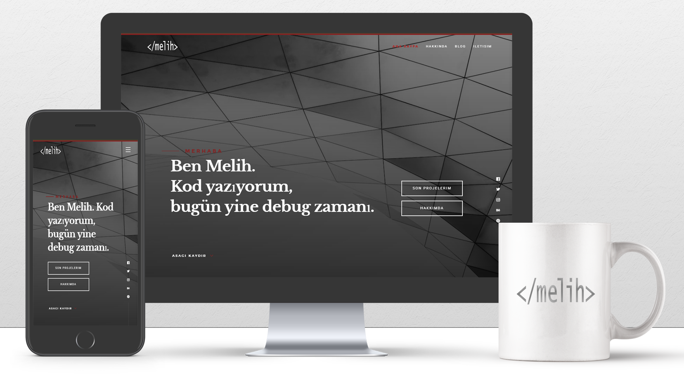

# MyPortfolioWebApp

Welcome to **MyPortfolioWebApp**, a dynamic personal portfolio application designed to showcase professional skills, experiences, and projects. Built with the power of **ASP.NET Core**, this web application is ideal for developers, freelancers, and professionals looking to present their work in an organized and elegant way.

## Features

- **Responsive Design**: Ensures compatibility with all devices.
- **Skills Section**: Highlight your technical and professional skills.
- **Projects Showcase**: Present your portfolio projects with descriptions and links.
- **Dynamic Content**: Data-driven content using a backend database.
- **Admin Panel**: Manage content such as skills, projects, and other sections with ease.
- **Contact Section**: Provide ways to get in touch via forms and social media links.

## Technologies Used

- **Frontend**: HTML, CSS, JavaScript, and Bootstrap for responsive design.
- **Backend**: ASP.NET Core (C#).
- **Database**: Microsoft SQL Server with Entity Framework Core.
- **Version Control**: Git and GitHub for repository management.
- **Icons**: Bootstrap Icons.

## Getting Started

### Prerequisites

Make sure you have the following tools installed on your system:
- Visual Studio 2022 or later.
- .NET 6.0 SDK.
- SQL Server (LocalDB or Azure SQL for production).
- Git for version control.
